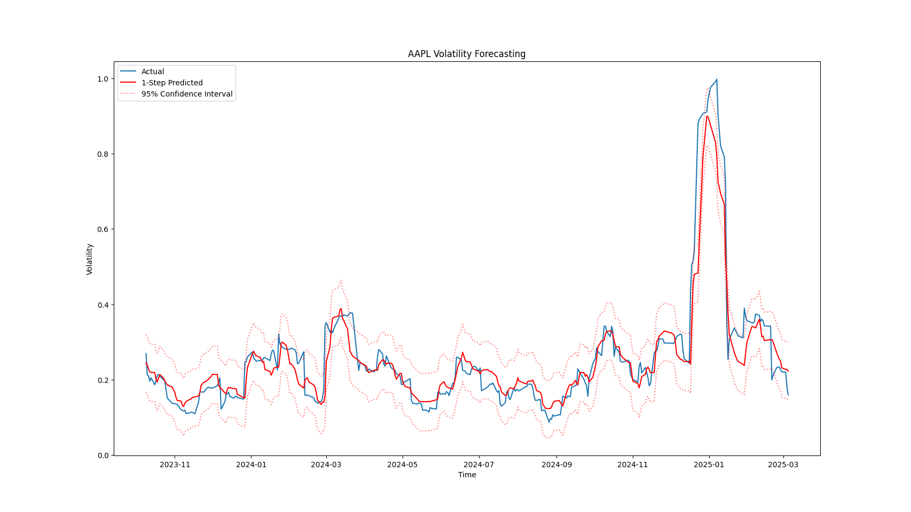
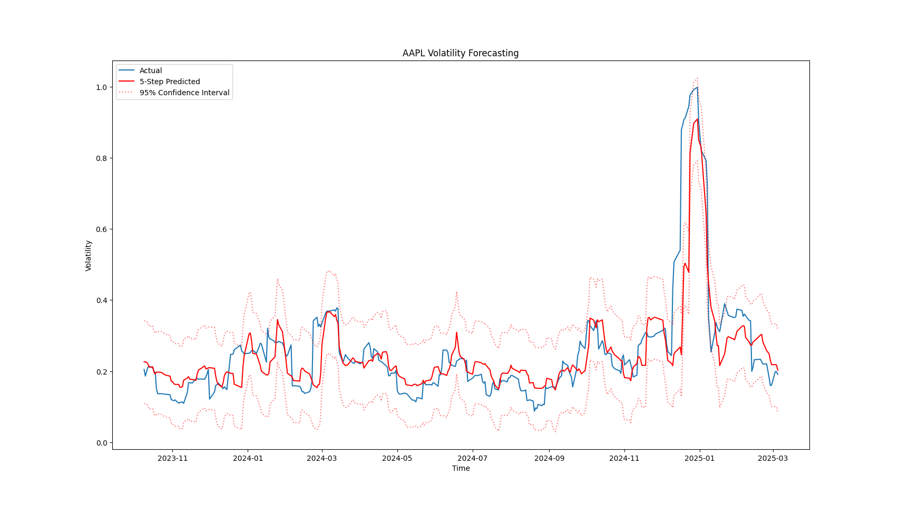
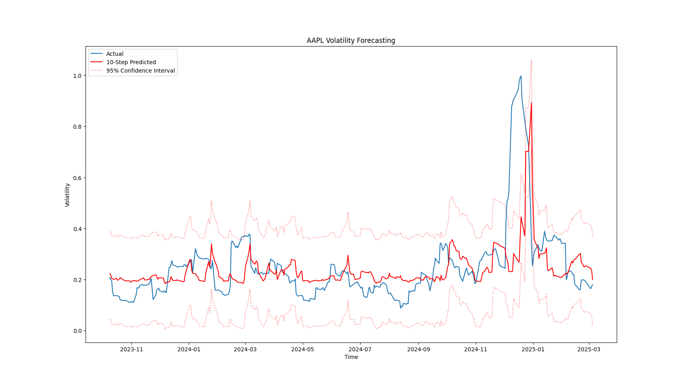
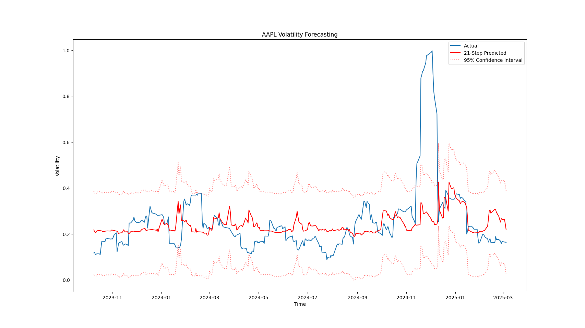
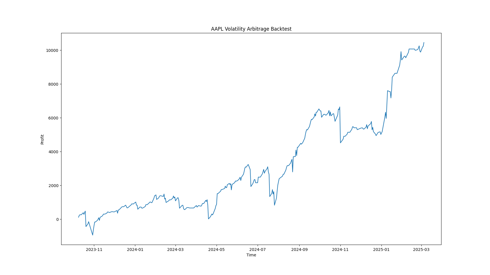
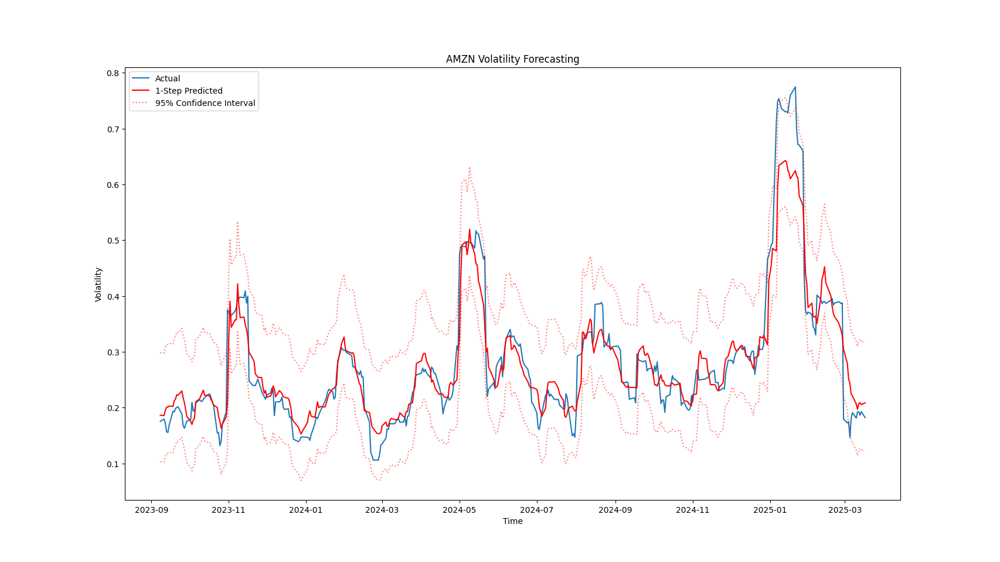
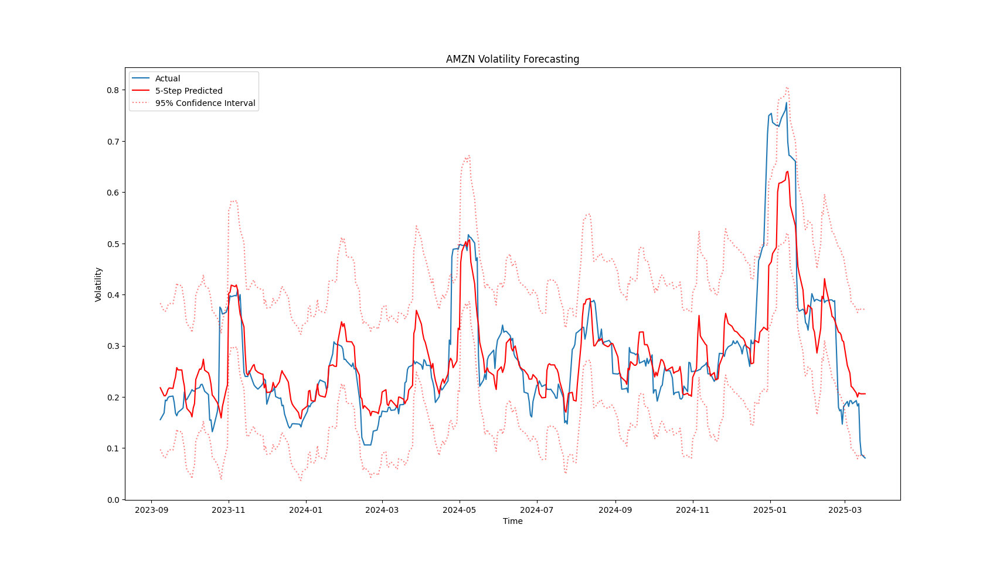
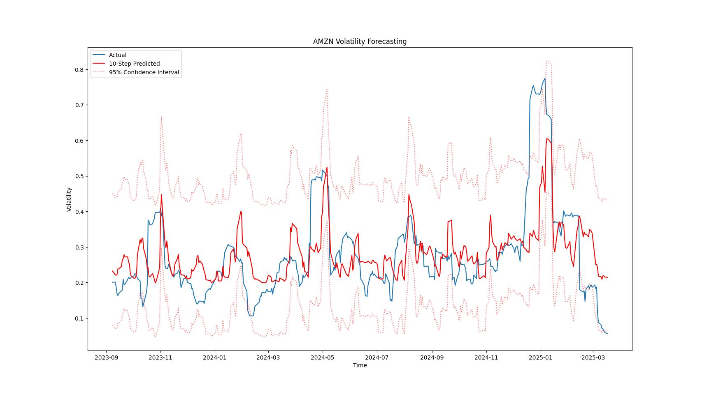
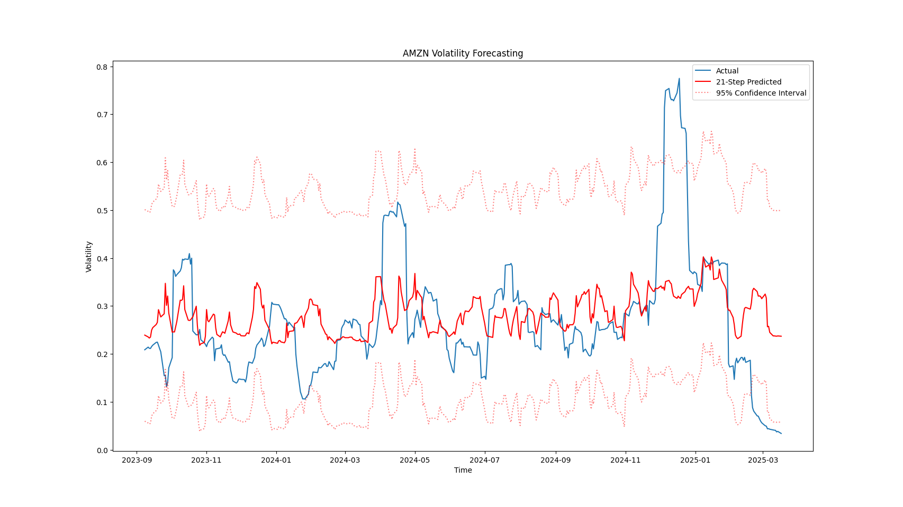
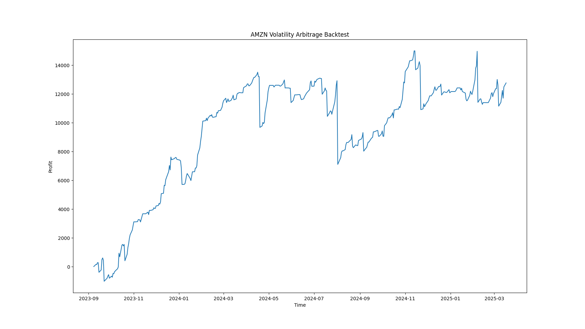

# Self-Supervised LSTM + XGBoost Volatility Arbitrage Trading Model
## Overview
### Features
* Devised self-supervised LSTM encoder to capture path-dependent signals across 20+ years of daily options chain data
* Used XGBoost to forecast volatility using encoder output, improving test error by 50% over LSTM baseline
* Optimized position sizing through statistical uncertainty quantification using $z$-scores and independent error distributions, resulting in a 38% improvement in total model profit per symbol on test set data 

### About Me
I am a Physics & Applied Mathematics major at the University of Notre Dame. I have extensive experience in data analytics, mathematical modeling, and machine learning throughout experimental nuclear physics, an NSF undergraduate research fellowship, and a quantitative finance internship. If you would like to get in touch, please reach out via email at [tgore@nd.edu](mailto:tgore@nd.edu).

## Introduction
*Volatility arbitrage* is an options trading strategy that attempts to profit from the difference between the implied and realized volatility of an option. A high implied volatility suggests that the market is pricing in large moves in the underlying's value, making options more expensive. Conversely, a low implied volatility suggests that the market believes the price of the underlying to remain stable.

Obviously, the market cannot see the future, so the market's forecast of an asset's volatility may not align with the asset's realized volatility as time progresses. This leads to an inefficiency in the pricing of options themselves; the market may, for example, anticipate high volatility and subsequently overprice options, leaving way for a clever trader to profit. If one can accurately forecast future volatility, one can therefore identify and profit from these inefficiencies between the market's expectation of volatility and its actual result.

To focus positions solely on volatility, a trader *delta hedge* their position, which encompasses buying an asset whose value moves in the opposite direction as the option position with the price of the underlying. Usually, this is done by buying/shorting the underlying itself, but there are much more complicated hedging methods that I won't expand upon here. The key takeaway is that, through delta hedging, we can trade and profit solely from volatility and time, removing directional considerations from our position.

In general, we can tell that an option is *overpriced* when its implied volatility $\sigma_{\text{IV}\_t}$ is greater than its actual volatility $\sigma_{\text{RV}\_{t+h}}$ after some horizon $h$. Likewise, the option is *underpriced* when the opposite is true:

$$ \text{Overpriced: } \sigma_{\text{IV}\_t} > \sigma_{\text{RV}\_{t+h}} $$

$$ \text{Underpriced: } \sigma_{\text{IV}\_t} < \sigma_{\text{RV}\_{t+h}} $$

## The Model
Clearly, we are in need of a sophisticated tool to compute the realized volatility $h$ steps in the future. This falls under the umbrella of *time series analysis*, the practice of analyzing data that exhibits path dependence. Path-dependent data requires special models that respect current data points' dependence on past data points. 

### LSTM Models
One nonlinear time series model is called the *long short-term memory* (LSTM) model, a type of recurrent neural network that can learn long-term dependencies in sequential data. LSTMs are very useful in time series analysis, and they have a proven track record in quantifying trends over arbitrary time intervals.

When neural networks are trained on data, they translate what they see into high-dimensional spaces known as *hidden layers*. These hidden layers can easily capture highly nonlinear relationships in the data. Specifically, when an LSTM is trained, it generates *hidden states*, or *embeddings*, that capture the relationships between the different features and past data that it has already seen. In essence, the embeddings are a high-dimensional representation of the path-dependent signals across the data. I will use the LSTM as an encoder that generates the embeddings from the data. The next part of the model generates the volatility forecasts themselves.

### Gradient Boosting
The embeddings themselves are not easily interpretable, especially not to humans. Typically, we would end the LSTM with a final layer that maps the embeddings to our dataset's target values. By my testing, however, many of these methods fail to capture the realized volatility when it has high variance. A stronger method is needed to translate the embeddings to tradable insights.

*Gradient boosting* cleverly leverages decision trees to quickly capture nonlinear relationships between features and the response variable(s). Suppose we ant to learn a function $f(x)$ that predicts $y$. We start with a simple model $f_{0}(x)$ and, at each step $m$, we add a decision tree $h_m(x)$ to improve the model. For learning rate $\nu$, this looks like:

$$ f_{m}(x) = f_{m-1}(x) + \nu h_m(x) $$

At each step, we decide which decision tree to add by computing the negative gradient of the loss with respect to the current predictions. The next tree is then fit to predict these residuals, reducing the overall error.

The fits of decision trees themselves are nonlinear, so gradient boosting can easily handle nonlinear interactions. Therefore, ensembling it with the LSTM model can easily translate the embeddings to $h$-step realized volatility predictions. Overall, the LSTM helps quantify the "time" part of the time series data, and the gradient boosting model translates the insights extracted by the LSTM into realized volatility forecasts we can use to inform our trades.

### Trade Generation
The model cannot be entirely certain of its predictions across the entire prediction horizon. To quantify fit uncertainties, a Gaussian distribution is fit to the residuals of each step's volatility forecasts. Positions are then sized according to a $z$-score representing the significance of the forecasted deviation between $\sigma_{\text{IV}\_t}$ and $\sigma_{\text{RV}\_{t+h}}$:

$$ z = \frac{\sigma_{\text{IV}\_t} - \sigma_{\text{RV}\_{t+h}}}{\sigma_{h\text{-step fit}}} $$

Note that $\sigma_{\text{IV}\_t}$ is rescaled to match the horizon $h$.
The model will only trade if $|z| > 1.93$, a ~95% confidence interval. It will then look at the entire interval's $z$-scores and design a trading strategy for the selected option to exploit volatility-driven mispricing. All trades are done via long/short positions in puts. At the end of each time step, the model will buy/sell short a certain number of shares of the underlying stock to delta hedge its position, ensuring we are trading solely based on volatility and time.

## Data
The data (obviously) is not included in this repository. It is daily options data combined with daily OHLCV data, both stored in delta lake format, making read operations simple and easy. The data was ~27 GB in total, so delta lake's compression capabilities were instrumental in keeping storage reasonable. Additionally, DuckDB's lazy evaluation and vectorized operations helped to avoid memory issues when using this data to fit the model. If you are a quantitative analyst and use large datasets often, DuckDB is a good choice.

The targets and features are not immediately ready when the data is imported. The model constructs windows of length $T$ (set by the user) that control how far back the model looks for each data point. I used $T = 64$ and had solid results, as seen below.

## Results
Below, I'll show a couple examples of this algorithm in action. Many more exist, but I figured I'd test it on two well-known stocks, with a test set including a particularly volatile market period. At every horizon $h$ from 1 day to 21 days from the current time step, the model outputs its prediction over the horizon and a confidence interval for that prediction that is later used in trade generation. For each of the stocks below, I will show the realized volatility predictions at various horizons $h$ and the final result of the trading algorithm.
### AAPL
The model achieved an especially good fit on AAPL in short time frames. Shorter horizon forecasts are nearly exact, while longer horizons may miss volatility spikes but still capture the general trend of the data.

Despite less confidence in longer-horizon predictions, the trading algorithm appeared well-equipped to trade on the information it was given, achieving a peak profit of over $10000 over the test set duration.

### AMZN
The model had slightly weaker performance on AMZN short horizon predictions, but longer horizon predictions more closely resembled the general trend of the data. 

The performance of the model on AMZN had similar results, locking in a final profit of over $12000 over the test set duration:

### Overall Takeaways
The model generally seems to prove a strong predictor of realized volatility, and volatility arbitrage strategies can greatly benefit from its insight. There are many areas of potential improvement, particularly in the features used to train the LSTM and some of the neural network hyperparameters themselves. Overall, however, the model achieved a good fit as it is. My purpose was not necessarily to "beat the market" but rather to explore the interesting mathematical problems you can encounter in a financial context. Please reach out to [tgore@nd.edu](mailto:tgore@nd.edu) if you have any inquiries about this project or would like to set up an interview.

*Disclaimer: this project was constructed solely for academic purposes as a way for me to showcase my knowledge of machine learning and data analysis. No part of this project constitutes financial advice. If you deploy this model live, you assume all risks relating to options trading.*
